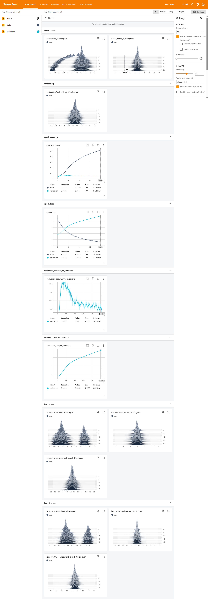
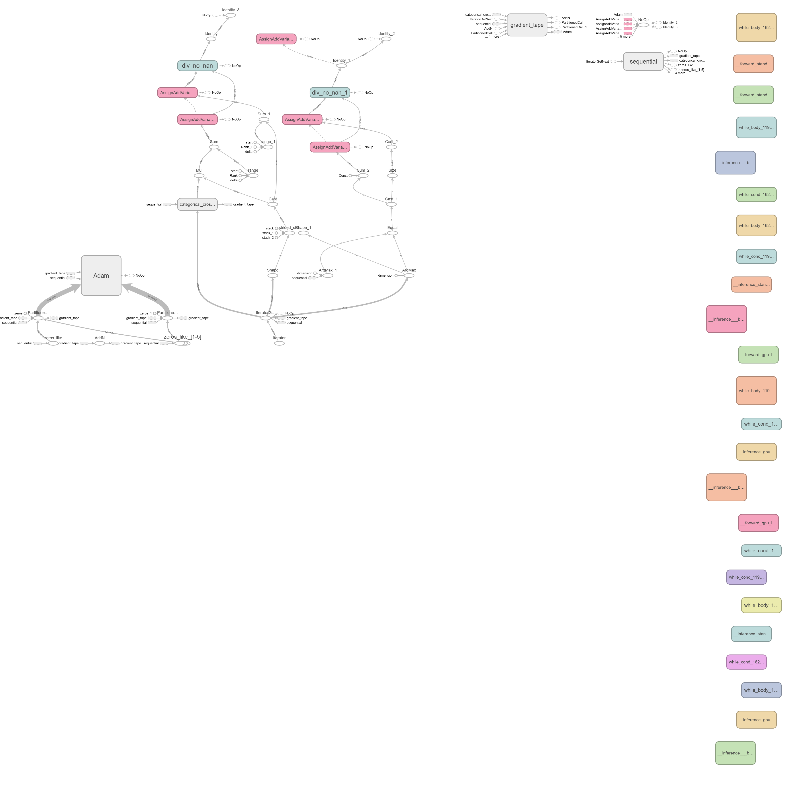

# 📖 Next Word Prediction using LSTM

A deep learning project that predicts the **next word** in a sentence using a **Long Short-Term Memory (LSTM)** neural network trained on **William Shakespeare's Hamlet**. The model learns the sequential relationships between words and generates the most probable next word based on the user's input.

---

## 🚀 Demo

Enter a sequence of words:

```text
Input : To be or not
Output: To
```

```text
Input : The king
Output: is
```

> **Note:** Predictions may vary depending on the trained model.

---

## ✨ Features

- 📚 Trained on Shakespeare's *Hamlet* dataset.
- 🧠 Deep LSTM-based language model.
- 🔤 Tokenization and sequence generation using Keras Tokenizer.
- 💾 Saved trained model (`.keras`) and tokenizer (`.pickle`) for inference.
- 📈 TensorBoard integration for monitoring training metrics.
- ⚡ Simple Python application for real-time next-word prediction.

---

## 🛠️ Tech Stack

- Python
- TensorFlow / Keras
- NumPy
- Pickle
- TensorBoard

---

## 📂 Project Structure

```text
Next-Word-Prediction/
│
├── app.py                      # Inference application
├── experiments.ipynb           # Model training notebook
├── hamlet.txt                  # Training dataset
├── next_word_lstm.keras        # Trained LSTM model
├── tokenizer.pickle            # Saved tokenizer
├── requirements.txt
├── README.md
└── logs/                       # TensorBoard logs
```

---

## 📖 Dataset

The model is trained using **Hamlet**, one of William Shakespeare's most famous tragedies.

### Preprocessing Steps

- Convert text to lowercase
- Tokenize text using Keras Tokenizer
- Generate n-gram sequences
- Pad sequences to equal length
- Split into input and output
- One-hot encode output labels

---

## 🧠 Model Architecture

```
Input Text
      │
      ▼
Tokenizer
      │
      ▼
Padding
      │
      ▼
Embedding Layer
      │
      ▼
LSTM (150 Units)
      │
      ▼
LSTM (150 Units)
      │
      ▼
Dense Layer (Softmax)
      │
      ▼
Predicted Next Word
```

### Model Configuration

| Parameter | Value |
|-----------|-------|
| Embedding Layer | Yes |
| LSTM Layers | 2 |
| LSTM Units | 150 |
| Optimizer | Adam |
| Loss Function | Categorical Crossentropy |
| Metric | Accuracy |

---

## 📦 Installation

Clone the repository

```bash
git clone https://github.com/<your-username>/Next-Word-Prediction.git
```

Move into the project directory

```bash
cd Next-Word-Prediction
```

Create a virtual environment

```bash
python -m venv venv
```

Activate the environment

**Windows**

```bash
venv\Scripts\activate
```

**Linux / macOS**

```bash
source venv/bin/activate
```

Install dependencies

```bash
pip install -r requirements.txt
```

---

## ▶️ Training the Model

Launch Jupyter Notebook

```bash
jupyter notebook
```

Open

```
experiments.ipynb
```

Run all cells to:

- Load dataset
- Preprocess text
- Train the model
- Save trained model
- Save tokenizer
- Generate TensorBoard logs

---

## 💻 Running the Application

```bash
python app.py
```

Enter a sentence and the model predicts the most likely next word.

---

## 📈 TensorBoard

Start TensorBoard

```bash
tensorboard --logdir logs/fit
```

Open your browser

```
http://localhost:6006
```

TensorBoard includes:

- ✅ Training Accuracy
- ✅ Validation Accuracy
- ✅ Training Loss
- ✅ Validation Loss
- ✅ Layer Histograms
- ✅ Embedding Visualizations
- ✅ Model Computational Graph

---

## 📊 Training Results

The model was monitored using TensorBoard throughout training.

### Metrics Tracked

- Training Accuracy
- Validation Accuracy
- Training Loss
- Validation Loss

### Visualizations

- Weight Histograms
- Embedding Histograms
- Computational Graph
- Training Curves

---

## 🔮 Future Improvements

- Implement Beam Search decoding
- Add Top-k and Top-p sampling
- Train on larger text datasets
- Replace LSTM with GRU
- Experiment with Transformer-based language models
- Deploy using Streamlit or Flask
- Hyperparameter tuning for improved accuracy

---

## 📸 Screenshots

### TensorBoard Dashboard



### Computational Graph



> Place your screenshots inside an **images/** folder and update the filenames if necessary.

---

## 🤝 Contributing

Contributions are welcome!

1. Fork the repository
2. Create a new feature branch

```bash
git checkout -b feature-name
```

3. Commit your changes

```bash
git commit -m "Add new feature"
```

4. Push to your branch

```bash
git push origin feature-name
```

5. Open a Pull Request

---

## 👨‍💻 Author

**Devansh Agrawal**
---

## ⭐ Support

If you found this project helpful, consider giving it a ⭐ on GitHub.

It helps others discover the project and motivates further development.

---